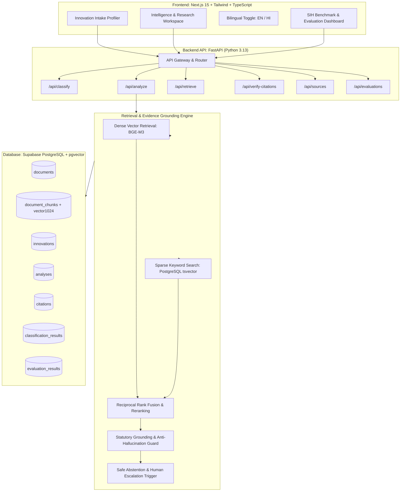

# IP-SAKTI Sahayak — System Architecture

## 1. System Mission & Boundary
**IP-SAKTI Sahayak** is an evidence-grounded, jurisdiction-aware intelligence copilot for Ayurveda innovation. It is engineered specifically for Ayurveda researchers, startups, and institutions to synthesize authoritative statutory, patent, biodiversity, and scientific evidence.

### What IP-SAKTI Sahayak IS:
- A multi-tier evidence grounding engine synthesizing Indian and international statutes.
- A jurisdiction-aware router separating India, United States (FDA), and Australia (TGA).
- An anti-hallucination verification workspace with explicit citation verification tags (`VERIFIED`, `NOT_VERIFIED`, `INSUFFICIENT_EVIDENCE`).
- A safe abstention engine that refuses to speculate on unsupported legal outcomes.

### What IP-SAKTI Sahayak IS NOT:
- NOT a generic AI chatbot or medical diagnosis tool.
- NOT a legal advice service or patent filing system.
- NOT a replacement for statutory authorities (Indian Patent Office, CDSCO, NBA, US FDA, TGA).
- DOES NOT claim unauthorized or simulated access to TKDL (Traditional Knowledge Digital Library).

---

## 2. Architectural Diagram



---

## 3. End-to-End Decision Flow
```
Understand (Intake Profiler)
   ↓
Classify (Classical ASU vs Patent & Proprietary vs FSSAI Nutraceutical)
   ↓
Route (India AYUSH / US FDA DSHEA / Australia TGA)
   ↓
Retrieve (Hybrid Dense BGE-M3 + Sparse Keyword PostgreSQL)
   ↓
Verify (Grounding Score & Authority Tier Matching)
   ↓
Explain (Synthesized Multi-Domain Intelligence Dossier)
   ↓
Act / Escalate (Actionable Recommendations or Human Expert Escalation Flag)
```
